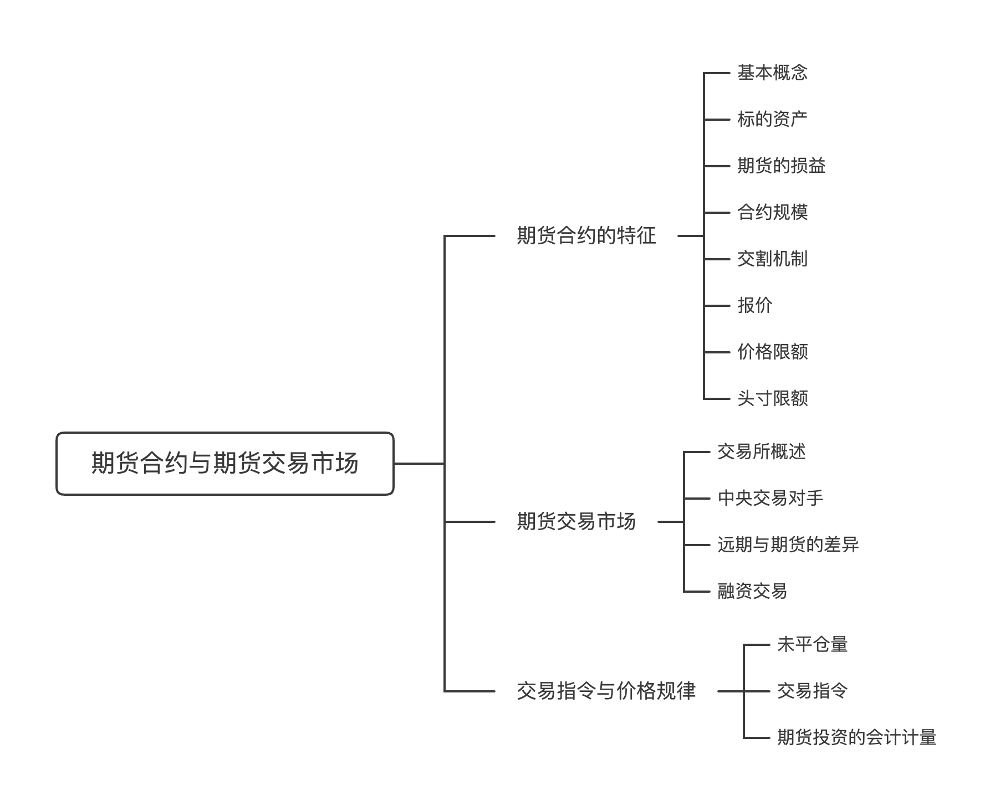

---

# 期货合约的特征

## 基本概念

期货合约：一种标准化的，且在期货交易所中交易的合约。

- 标准化：合约标的资产的种类、品级、交割时间、交割数量、交割方式的标准化

## 标的资产

- 主要分为：货币类、利率类、指数类、金属类、能源类、农产品类、牲畜类
- 如果标的资产是大宗商品，实际交割商品的品级需要非常明确

## 期货的损益

**（一）平仓**

平仓（closed out）/反向平仓（offset position）：在合约到期之前，在原有仓位的基础上，通过买入（卖出）与其所持期货品种、数量、交割月份相同，但交易方向相反的合约来对冲掉原有仓位，从而提前结束合约。

**（二）期货的损益**

假设在合约签订初期，期货合约价为$F_0(T)$，在 $t$ 时刻进行期货平仓，期货价为 $F_t(T)$

- 如果持有多头头寸，并反向平仓，则平仓时的损益为 $Payoff=F_t(T)-F_0(T)$
- 如果持有空头头寸，并反向平仓，则平仓时的损益为 $Payoff=F_0(T)-F_t(T)$
- 多头收益无限，损失有限；空头损失无限，收益有限

## 合约规模

- 标的资产为金融资产的期货合约规模比较大
- 标的资产为农产品的期货合约规模比较小

## 交割机制

**（一）交割方式**

- 实物交割（physical delivery）：期货合约到期时，多头按照合约支付给空头相应金额，空头将标的资产交付给多头

- 现金交割（cash settlement）：多空双方根据此时标的资产的现货价格和期货合约价之差进行结算，无须交割实物

**（二）交割地点**

- 对于大宗商品类期货，交割地点会影响资产交割的运输成本，从而影响标的资产的价格

**（三）交割时间**

- 期货合约会根据交割月份来命名，但每类合约具体的交割时间(delivery time)并不完全相同
- 每日结算价格(settlement price)：当天交易收盘时的期货价格，会用于每日结算
- 随着期货合约临近到期，期货价格会不断趋近于现货价格，到期两者价格相等

## 报价

交易所会提供期货合约的报价(price quotes)以及最小变动价格

## 价格限额

- 价格限制 (price limit) ：交易所设置的期货价格最大的浮动范围
    - 目标在于限制市场操纵
    - 会妨碍真实市场价格的实现

- 涨停(limit up)：期货合约的价格达到价格上限

- 跌停(limit down)：期货合约的价格达到价格下限

- limit move：涨停与跌停两者之的范围

## 头寸限额

- 头寸限额(position limits)：交易所规定的会员或者客户按单边计算的、可以持有某一期货合约投机头寸的最大数量。
    - 防范操纵市场价格的行为
    - 防止市场风险过度集中于少数投机者
- 头寸限制都以 “手” (lot)作为单位，但通常交易头寸限制都非常大，大多数交易者不受影响

# 期货交易市场

## 交易所概述

**（一）基本概念**

交易所（场内市场）：根据国家相关证券法律规定，有组织地、规范地为众多的金融工具提供集中交易的场所和平台

- 国内的期货交易所：郑州商品交易所、上海期货交易所、上海国际能源交易中心、大连商品交易所、中国金融期货交易所
- 国外的期货交易所：CME集团（全球最大的期货交易所，旗下包括芝商所商业交易所(CME)、芝商所期货交易所(CBOT)、纽约商业交易所(NYMEX)、商品交易所(COMEX)）

**（二）期货交易所的运作机制**

公开喊价系统(open-outery system)：交易员会聚集在交易所的交易大厅，通过大声喊价的方式进行交易

- 优势
    - 通过面对面的交流和观察他人的行为来获取更多市场信息，更好地把握市场走势
    - 通过声音和手势等方式传达更多的信息，增加交易的透明度和互动性
- 劣势
    - 具有一定的地域限制，不够灵活
    - 容易出现交易误解或者信息不对称的情况，影响交易效率和公平性
    - 交易速度也会相对较慢

电子交易(electronic trading)：通过计算机网络进行交易，交易员可以通过电子交易平台提交订单、查看市场行情和成交情况

- 优势
    - 交易更为便捷和高效
    - 减少了交易误解和信息不对称的可能性
    - 提供更多的交易工具和数据分析功能，帮助交易员更好地进行决策
- 劣势
    - 缺乏面对面的交流和观察，容易导致交易员获取的市场信息不够全面
    - 系统故障和网络延迟等风险，可能影响交易的稳定性和可靠性

## 中央交易对手

**（一）基本概念**

中央对手方(central counterparties，CCPs)：在结算过程中介入证券交易买卖双方之间，成为“买方的卖方“和“卖方的买方”的机构，负责清算成员之间的所有交易。

- 多边净额结算一般要求结算机构作为中央对手方，成为所有结算参与人唯一的交易对手
- 优势
    - 担保交易：买卖中的一方不能正常向中央对手方履约，中央对手方也应当先对守约的一方履约，使买卖双方规避了信用违约风险
    - 快速平仓

**（二）信用风险管理**

净额结算(netting)：多空双方的头寸被整合为CCP对每一个交易者的净头寸

逐日盯市和保证金制度

- 逐日盯市(daily settlement) / 每日结算：每个交易日结束后，CCP都会根据当日盈亏状况对投资者的账户进行结算，并根据当天的结算价格(settlement price)来确定收益
- 保证金：投资者必须存入其经纪人或交易所的抵押品，以弥补持有人所面临的信用风险
    - 清算会员可选择用证券代替现金来充当保证金，但需结合一定折扣比例(haircut)折算，折扣率与证券的波动率成正比
- 初始保证金(initial margin)：清算会员在开仓时必须按期货合约规模缴纳一定比率的金额，比例由交易所设定
- 维持保证金(maintenance margin)：触发提醒的基准线，通常大幅低于初始保证金。若账户亏损至维持保证金水平之下，则会收到交易所的保证金补缴，要求清算会员将其账户余额补充至最低初始保证金水平。
- 变动保证金(variation margin)：在每个交易日盈利和损失的具体金额
    - 亏损方一旦无法支付变动保证金，CCP就必须将其期货头寸强制平仓并用自己的资金支付给盈利方
- 保证金的利息支付
    - 对于变动保证金，CCP并不对其支付利息
    - 对于初始保证金，CCP会支付相应的利息

违约基金(default fund contribution)

- 所有清算会员都必须缴纳
- 一旦某会员违约且其保证金不足以弥补损失时，则需要用它缴纳的违约基金来补偿
- 如果仍然不足，则使用其他成员的违约基金额度
- 如果损失仍然无法弥补，则CCP需使用自身的所有者权益

## 远期与期货的差异

**（一）交易所市场与OTC市场的差异**

| 交易所市场               | OTC市场                      |
| ------------------------ | ---------------------------- |
| 标准化合约               | 定制化合约                   |
| 清算所中央对手方参与交易 | 对手方直接交易(存在违约风险) |
| 有固定交易场所           | 无固定交易场所               |
| 受严格监管               | 监管力度小                   |
| 交易量较小               | 交易量较大                   |

**（二）远期合约与期货合约的差异**

共同点：在买卖双方刚签订合约时，买卖双方之间不发生任何现金流的交换

| 远期合约                        | 期货合约                          |
| ------------------------------- | --------------------------------- |
| OTC市场交易                     | 交易所交易(exchange-traded)       |
| 个性化合约(customized contract) | 标准化合约(standardized contract) |
| 存在违约风险                    | 无违约风险                        |
| 监管较少                        | 高度监管                          |
| 无保证金要求                    | 存在保证金要求                    |
| 到期结算交割                    | 每日盯市制度(mark-to-market)      |
| 到期实物交割                    | 到期日前反向平仓                  |

## 融资交易

融资买入(buying on margin)交易 / 保证金交易 / 垫头交易：投资者从经纪商处借入部分资金来购买股票

# 交易指令与价格规律

## 未平仓量

未平仓量(open interest) / 持仓量：某一特定期货合约品种在特定交易日结束时尚未平仓的合约总数，用于反映市场活跃度和流动性

- 当两个会员签订一份新的期货合约，即为开仓，那么未平仓量+1
- 合约签订后，一个会员进行了平仓，而另一个会员继续持有，那么未平仓量将保持不变
- 如果签订期货合约的双方同时平仓，那么未平仓量将-1

## 交易指令

**（一）交易指令的类型**

- 市价指令(market order)：交易将按照市场当前能立即成交的价格快速成交的一种指令
- 限价指令(limit order)：只有在某一价格水平或优于该价格水平才可执行的客户交易指令
- 止损指令(stop-loss order) / 停损指令 / STOP指令：当市场价格达到客户预计的价格水平时或者是更加不利的价格的时候即变为市价交易指令的一种指令
- 止损限价指令(stop-limit order)：止损交易指令和限价交易指令的结合，可以帮助投资者限制其在某期货头寸上的亏损并限定成交价格区间。一旦市场价格达到了止损价格或是变得比止损价格更不利时，这一交易指令就变成了限价交易指令
- 触及市价指令(market-if-touched order)：预先设定价格，待市场价格达到设定价格或者更有利的价格时，自动转化为市价交易指令
- 自行裁定指令(discretionary order) / 全权委托指令：给予经纪人决策权，以最佳的价格为客户买卖证券的指令

**（二）交易指令的时效**

- 一般而言，一个指令的时效性为1天，如果当天没有被执行则被取消
- 全部成交否则取消指令(fill or kil order)：所下委托单要么在几秒钟之内全部成交，要么立即取消
- 开放指令(open order/good-till-cancelled order)：在期货到期前除非被主动取消，否则都有效

## 期货投资的会计计量

**（一）传统会计准则**

- 规定期货合约的利得和损失在发生时确认
- 导致财务报表中的利润波动(earning volatility)较大，与套期保值的初衷相悖

**（二）套期保值会计处理**

- 将期货的盈亏和被对冲标的的盈亏在同一期计入损益，使套期保值锁定成本或收益水平的经济实质得以反映
- 监管机构对套期保值会计的使用有严格的规定
    - 被套期保值的标的和用于套期保值的工具都要非常明确
    - 套期保值活动必须有效（被套期保值的标的和套期保值的工具之间的经济关系必须真实存在）
- 税务角度：该交易的目的是降低风险敞口