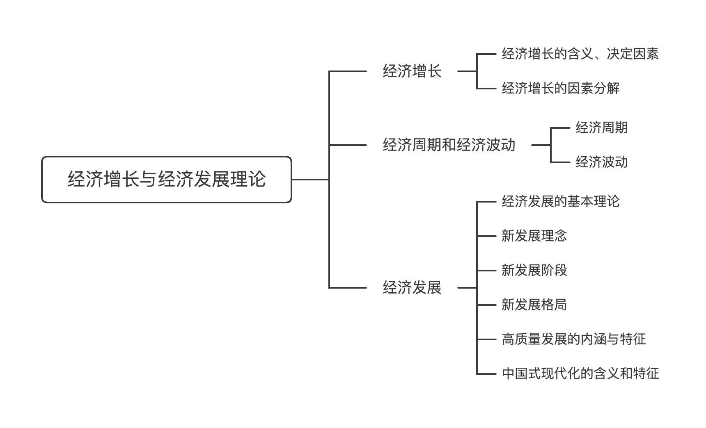

# 经济增长

## 经济增长的含义、决定因素

**（一）经济增长的含义**

一个国家或地区在一定时期内的总产出与前期相比所实现的增长。总产出通常用 GDP 或人均 GDP 来衡量

- 用现行价格计算的 GDP：反映一个国家或地区的经济发展规模
- 用不变价格计算的 GDP：计算经济增长速度
- 经济增长是经济发展的基础，但经济增长并不等同于经济发展

**（二）决定经济增长的基本因素**

- 劳动的投入数量：取决于人口规模、人口结构、投入的劳动时间多少
- 资本的投入数量
- 劳动生产率：一般用在一定时间内每个劳动者所生产的 GDP，或单位劳动时间所生产的GDP 来计算
- 资本的效率：单位资本投入数量所能产生的 GDP。一般用 GDP 与资本总额的比率来表示，也可以用生产单位 GDP 需要投入的资本数量来表示

## 经济增长的因素分解

**（一）两因素分解**

假设把经济增长率按照劳动和劳动生产率两项因素进行分解：

- $$经济增长率 G_Q=工作小时数的增加率 G_H+每小时产出的增加率 G_P$$

**（二）三因素分解**

把经济增长按劳动投入、资本投入和全要素生产率进行分解：

- 经济增长率=技术进步率+（劳动份额 * 劳动增加率）+（资本份额 * 资本增长率）
    - 技术进步率（索洛余值、全要素生产率（简称 TFP））：将劳动、资本等要素投入数量等因素对经济增长率的贡献扣除之后，技术进步因素对经济增长的贡献份额

# 经济周期和经济波动

## 经济周期

**（一）经济周期的含义** 

经济周期（商业循环）：指总体经济活动随着经济增长的总体趋势而出现的有规律的扩张和收缩

**（二）经济周期的类型**

按照周期波动的时间长短

- 长周期（长波循环，康德拉耶夫周期）：周期长度平均为 50~60 年
- 中周期（大循环，朱格拉周期）：周期长度平均约为 8 年
- 短周期（小循环，基钦周期）：周期长度平均为 3~5 年

按照经济总量绝对下降或相对下降的不同情况

- 古典型周期：经济运行处在低谷时的经济增长为负增长，经济总量 GDP 绝对减少
- 增长型周期：经济低谷时经济增长率为正值，经济总量相对减少
    - 我国经济周期属于增长型，波动幅度并不大

**（三）经济周期的阶段划分和阶段特征** 

- 扩张阶段：经济增长速度持续提高，投资持续增长，产量不断扩大、市场需求旺盛、就业机会增多、企业利润、居民收入和消费水平都有不同程度的提高，也常常伴随通货膨胀
- 紧缩或衰退阶段：经济增长速度持续下滑，投资活动萎缩，生产发展缓慢，甚至出现停滞或下降，产品滞销，就业机会减少，失业率提高，企业利润水平下降，亏损、破产企业的数量增多，居民收入和消费水平呈现不同程度下降趋势
- 不同的国家或地区或者同一个国家或地区的不同时期，经济周期的表现差别较大

## 经济波动

**（一）经济波动的原因** 

- 投资率的变动
- 消费需求的波动
- 技术进步的状况
- 预期的变化
- 国际经济因素的冲击
- 大规模疫情等因素的冲击

**（二）分析和预测经济波动的指标体系** 

一致指标（同步指标）：可以综合描述总体经济所处状态

- 国内生产总值
- 规模以上工业增加值
- 工业用电量
- 铁路货运量

先行指标：标可以预测总体经济运行的轨迹

- 采购经理指数
- 消费者信心指数
- 新开工项目计划总投资额

滞后指标：对总体经济运行中已经出现的峰谷的确定

- 企业利润
- 失业率
- 居民消费价格指数

# 经济发展

## 经济发展的基本理论

经济发展的含义：发展中国家或地区人民生活水平的持续提高，并伴随着物质资本和人力资本的增长以及技术的进步

- 产业结构的不断优化
- 城市化进程的逐步推进
- 广大居民生活水平的持续提高
- 国民收入分配状况的逐步改善

经济发展的核心：人民生活水平的持续提高

经济发展的基本内核：以人民为中心

经济发展的重要内容：可持续发展

## 新发展理念

- 创新：引领发展的第一动力
- 协调：持续健康发展的内在要求
- 绿色：永续发展的必要条件和人民对美好生活追求的重要体现
- 开放：国家繁荣发展的必由之路
- 共享：中国社会主义的本质要求

## 新发展阶段

**（一）“十五五”时期经济社会发展要实现的目标**

- 高质量发展取得显著成效
- 科技自立自强水平大幅提高
- 进一步全面深化改革取得新突破
- 社会文明程度明显提升
- 人民生活品质不断提高
- 美丽中国建设取得新的重大进展
- 国家安全屏障更加巩固

**（二）十五五规划纲要提出的经济社会发展主要指标**

- 国内生产总值年均增长保持在合理区间；全员劳动生产率增长高于国内生产总值增长
- 全社会研发经费投入年均增长 7%以上
- 常住人口城镇化率提高到 71%；
- 单位国内生产总值二氧化碳排放降低 17%
- 森林覆盖率提高到 25.8%
- 城镇调查失业率控制在 5.5%以内，居民人均可支配收入增长与国内生产总值增长基本同步
- 劳动年龄人口平均受教育年限提高到 11.7 年
- 人均预期寿命提高到 80 岁，养老机构护理型床位占比达到 73%

## 新发展格局

构建以国内大循环为主体、国内国际双循环相互促进的新发展格局，要更多依靠国内市场，将发
展的立足点放在国内

## 高质量发展的内涵与特征

**（一）经济高质量发展的内涵**

- 以人民为中心
- 创新成为第一动力
- 可持续绿色发展
- 城乡、区域协调发展
- 更加开放的发展

**（二）高质量发展和新质生产力**

- 发展新质生产力是推动高质量发展的内在要求和重要着力点
- 新质生产力是创新起主导作用，摆脱传统经济增长方式、生产力发展路径，具有高科技、高效能、高质量特征，符合新发展理念的先进生产力质态
    - 由技术革命性突破、生产要素创新性配置、产业深度转型升级而催生
    - 以劳动者、劳动资料、劳动对象及其优化组合的跃升为基本内涵
    - 以全要素生产率大幅提升为核心标志
    - 特点是创新，关键在质优，本质是先进生产力
    - 科技创新能够催生新产业、新模式、新动能，是发展新质生产力的核心要素
    - 绿色发展是高质量发展的底色，新质生产力本身就是绿色生产力

## 中国式现代化的含义和特征

**（一）中国式现代化的特征**

- 中国式现代化是人口规模巨大的现代化
- 中国式现代化是全体人民共同富裕的现代化
- 中国式现代化是物质文明和精神文明相协调的现代化
- 中国式现代化是人与自然和谐共生的现代化
- 中国式现代化是走和平发展道路的现代化

**（二）中国式现代化的本质要求、实现原则及战略安排**

- 本质要求：坚持中国共产党领导，坚持中国特色社会主义，实现高质量发展，发展全过程人民民主，丰富人民精神世界，实现全体人民共同富裕，促进人与自然和谐共生，推动构建人类命运共同体，创造人类文明新形态

- 实现原则：坚持加强党的全面领导，坚持中国特色社会主义道路，坚持以人民为中心的发展思想，坚持深化改革开放，坚持发扬斗争精神
- 战略安排：从 2020 年到 2035 年基本实现社会主义现代化；从 2035 年到本世纪中叶把我国建成富强民主文明和谐美丽的社会主义现代化强国